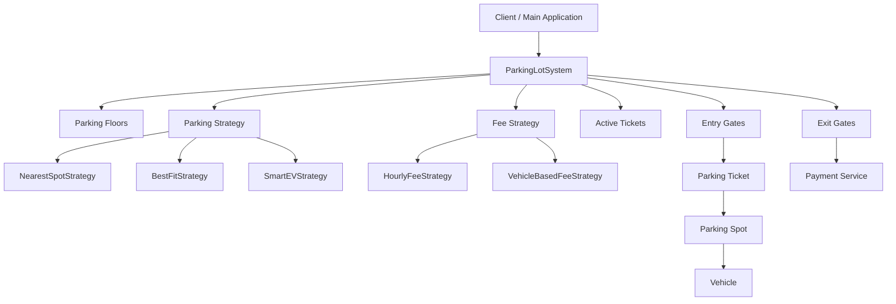
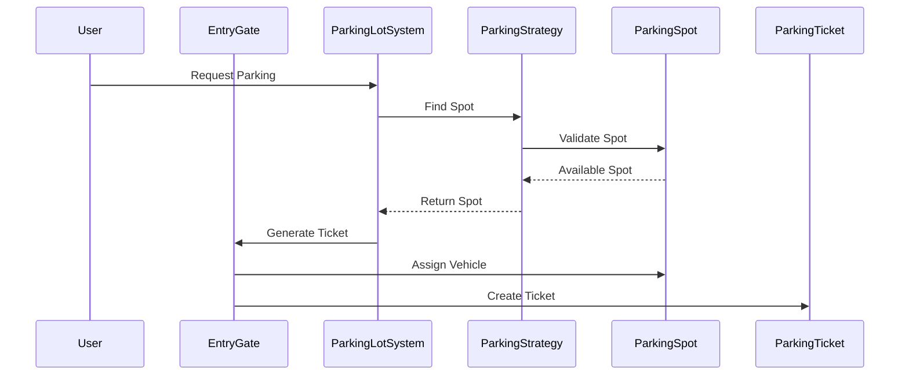
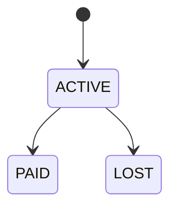
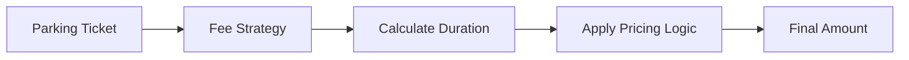

# 🚗 Parking Lot System — Low Level Design (LLD)

<div align="center">


*A scalable and extensible Parking Lot Management System built using Object-Oriented Design principles, Strategy Pattern, and modular architecture.*

</div>

---

# 📌 Project Overview

This project is a production-inspired **Parking Lot Management System** designed as a Low Level Design (LLD) exercise to demonstrate strong understanding of:

* Object-Oriented Programming (OOP)
* SOLID Principles
* Design Patterns
* Scalable Architecture
* Extensible System Design
* Real-world entity modeling
* Strategy-driven behavior abstraction

The system simulates how modern parking infrastructures operate using:

* Multi-floor parking management
* Vehicle-based spot allocation
* Dynamic parking strategies
* Dynamic fee calculation strategies
* Entry & Exit gate workflows
* Ticket lifecycle management
* Real-time parking availability tracking

This implementation focuses heavily on **clean architecture and maintainability**, making it a strong demonstration project for backend engineering interviews and system design discussions.

---

# ✨ Key Features

## 🚘 Parking Management

* Multi-floor parking support
* Vehicle-based parking spot allocation
* Real-time parking availability tracking
* Automatic ticket generation
* Vehicle exit workflow handling

## 🧠 Smart Allocation Strategies

* Nearest spot allocation
* Best-fit parking strategy
* EV-priority smart parking strategy

## 💳 Flexible Fee Calculation

* Hourly fee calculation
* Vehicle-based fee calculation
* Strategy-based pricing engine

## 🏢 Modular System Components

* Separate services for Entry & Exit gates
* Dedicated ticket management
* Isolated payment processing service
* Independent parking strategy layer

## 📊 Monitoring & Visibility

* Display board for parking availability
* Active ticket tracking
* Floor-wise parking visualization

---

# 🌍 Real-World Functionalities

This system models several real-world parking lot operations:

| Functionality           | Real-World Mapping                |
| ----------------------- | --------------------------------- |
| Entry Gate              | Vehicle entry & ticket issuance   |
| Exit Gate               | Payment & vehicle exit processing |
| Parking Spot Allocation | Smart parking management          |
| Display Board           | Mall/Airport parking indicators   |
| Ticket Lifecycle        | Entry → Active → Paid             |
| Fee Strategies          | Configurable billing models       |
| EV Strategy             | Dedicated EV parking support      |

---

# 🏗️ System Architecture Overview

The architecture is designed using a layered and modular approach.



---

# 🎯 Design Goals

The project was intentionally designed around the following engineering goals:

## ✅ Extensibility

New parking strategies, fee models, and vehicle types can be added with minimal code changes.

## ✅ Maintainability

Responsibilities are cleanly separated across:

* Models
* Services
* Strategies
* Managers
* Enums

## ✅ Scalability

The architecture supports future scaling into:

* Distributed parking systems
* Database integration
* REST APIs
* Microservices
* Multi-location deployments

## ✅ Loose Coupling

Business logic depends on abstractions (`ParkingStrategy`, `FeeStrategy`) rather than concrete implementations.

## ✅ Real-world Modeling

Entities closely resemble actual parking lot domain concepts.

---

# 📂 Folder Structure

```bash
ParkingLotSystem/
│
├── src/
│   ├── com.parkinglot/
│   │   └── Main.java
│   │
│   ├── enums/
│   │   ├── SpotType.java
│   │   ├── TicketStatus.java
│   │   └── VehicleType.java
│   │
│   ├── manager/
│   │   └── ParkingLotSystem.java
│   │
│   ├── model/
│   │   ├── Vehicle.java
│   │   ├── Bike.java
│   │   ├── Car.java
│   │   ├── Truck.java
│   │   ├── ElectricCar.java
│   │   ├── ParkingSpot.java
│   │   ├── ParkingFloor.java
│   │   ├── ParkingTicket.java
│   │   └── DisplayBoard.java
│   │
│   ├── service/
│   │   ├── EntryGate.java
│   │   ├── ExitGate.java
│   │   └── PaymentService.java
│   │
│   ├── strategy/
│   │   ├── fee/
│   │   │   ├── FeeStrategy.java
│   │   │   ├── HourlyFeeStrategy.java
│   │   │   └── VehicleBasedFeeStrategy.java
│   │   │
│   │   └── parking/
│   │       ├── ParkingStrategy.java
│   │       ├── NearestSpotStrategy.java
│   │       ├── BestFitStrategy.java
│   │       └── SmartEVStrategy.java
│
└── README.md
```

---

# 🧩 Class Diagram Explanation

The system is modeled around core parking domain entities.

## Central Orchestrator — `ParkingLotSystem`

The `ParkingLotSystem` class acts as the core manager of the entire application.

Responsibilities:

* Managing parking floors
* Managing entry & exit gates
* Holding active tickets
* Delegating parking allocation
* Delegating fee calculation
* Coordinating parking workflows

This class follows the **Singleton Pattern** to ensure only one parking system instance exists.

---

# 🔍 Core Components Breakdown

# 🚘 Models

## `Vehicle`

Abstract representation of a vehicle.

### Child Implementations

* `Bike`
* `Car`
* `Truck`
* `ElectricCar`

### Responsibilities

* Maintain license number
* Maintain vehicle type

This abstraction enables easy addition of future vehicle types.

---

## `ParkingSpot`

Represents an individual parking slot.

### Key Responsibilities

* Validates vehicle compatibility
* Maintains occupancy state
* Assigns/removes vehicles
* Encapsulates parking logic

### Important Method

```java
public boolean canFitVehicle(Vehicle vehicle)
```

This method maps:

* SMALL → BIKE
* MEDIUM → CAR
* LARGE → TRUCK
* EV → ELECTRIC

This design prevents invalid allocations.

---

## `ParkingFloor`

Represents a floor inside the parking lot.

### Responsibilities

* Store parking spots
* Find available spots
* Display floor availability

### Internal Design

Uses:

```java
Map<String, ParkingSpot>
```

This provides:

* Faster spot lookup
* Unique spot management
* Better scalability

---

## `ParkingTicket`

Represents the parking session lifecycle.

### Tracks

* Ticket ID
* Entry Time
* Exit Time
* Vehicle
* Assigned Spot
* Ticket Status

### Lifecycle

```text
ACTIVE → PAID
```

### Key Methods

```java
closeTicket()
calculateDuration()
```

The duration calculation is dynamically computed using timestamps.

---

## `DisplayBoard`

Responsible for displaying available parking spots across floors.

This mimics real-world parking guidance systems used in:

* Airports
* Shopping malls
* Smart city parking systems

---

# ⚙️ Services

## `EntryGate`

Handles vehicle entry workflow.

### Responsibilities

* Assign vehicle to spot
* Generate unique ticket
* Initialize parking session

### Important Logic

```java
UUID.randomUUID().toString()
```

Ensures globally unique ticket generation.

---

## `ExitGate`

Handles vehicle exit workflow.

### Responsibilities

* Close parking ticket
* Calculate fee
* Process payment
* Free parking spot

This class delegates payment responsibility to `PaymentService`.

---

## `PaymentService`

Encapsulates payment processing.

### Current Capability

* Simulated payment workflow

### Future Scope

Can easily integrate with:

* Stripe
* Razorpay
* PayPal
* UPI APIs

---

# 🧠 Strategies

# 🚗 Parking Strategies

## `ParkingStrategy` (Interface)

Defines parking allocation behavior.

```java
ParkingSpot findSpot(List<ParkingFloor> floors, Vehicle vehicle)
```

---

## `NearestSpotStrategy`

Allocates the first nearest available compatible spot.

### Use Case

* Fast allocation
* Minimal search overhead

---

## `BestFitStrategy`

Finds the best compatible parking spot.

### Use Case

* Better space utilization
* Optimized parking efficiency

---

## `SmartEVStrategy`

Prioritizes EV-specific parking spots.

### Use Case

* Electric vehicle charging zones
* Smart parking infrastructure

---

# 💰 Fee Strategies

## `FeeStrategy`

Defines parking fee calculation behavior.

```java
double calculateFee(ParkingTicket ticket)
```

---

## `HourlyFeeStrategy`

Calculates fees using:

```text
Duration × Hourly Rate
```

Current hourly rate:

```java
RATE_PER_HOUR = 50.0
```

---

## `VehicleBasedFeeStrategy`

Applies different pricing for different vehicle categories.

### Current Rates

| Vehicle Type | Rate |
| ------------ | ---- |
| BIKE         | 20   |
| CAR          | 50   |
| TRUCK        | 100  |
| ELECTRIC     | 40   |

This demonstrates configurable business-rule driven pricing.

---

# 📦 Enums

## `VehicleType`

Defines supported vehicle categories.

```text
BIKE
CAR
TRUCK
ELECTRIC
```

---

## `SpotType`

Defines parking spot categories.

```text
SMALL
MEDIUM
LARGE
EV
```

---

## `TicketStatus`

Defines ticket states.

```text
ACTIVE
PAID
LOST
```

---

# 🧠 Design Patterns Used

# 1️⃣ Strategy Pattern

The project heavily uses the Strategy Pattern.

### Parking Allocation

```java
ParkingStrategy
```

### Fee Calculation

```java
FeeStrategy
```

### Benefits

* Runtime behavior switching
* Open/Closed Principle support
* Easy feature extension
* Cleaner business logic separation

---

# 2️⃣ Singleton Pattern

Implemented in:

```java
ParkingLotSystem
```

### Why?

A parking lot should have a single centralized coordinator instance.

### Benefit

* Centralized state management
* Consistent system behavior
* Shared active ticket tracking

---

# 3️⃣ Polymorphism

Vehicle hierarchy demonstrates runtime polymorphism.

```java
Vehicle vehicle = new Car(...)
```

This enables abstraction-driven design.

---

# 📐 SOLID Principles Followed

| Principle                 | Implementation                                                       |
| ------------------------- | -------------------------------------------------------------------- |
| S — Single Responsibility | Services, models, and strategies each have isolated responsibilities |
| O — Open/Closed           | New strategies can be added without modifying existing code          |
| L — Liskov Substitution   | Vehicle subclasses replace parent abstraction seamlessly             |
| I — Interface Segregation | Small focused interfaces like `FeeStrategy` and `ParkingStrategy`    |
| D — Dependency Inversion  | High-level modules depend on abstractions                            |

---

# 🚦 Parking Flow Explanation



---

# 🎟️ Ticket Lifecycle



---

# 💳 Fee Calculation Workflow



---

# 🅿️ Parking Spot Allocation Logic

The allocation process follows:

1. Iterate through floors
2. Validate spot availability
3. Validate vehicle compatibility
4. Apply selected strategy
5. Allocate spot

### Compatibility Validation

```java
spot.canFitVehicle(vehicle)
```

This prevents invalid spot assignments.

---

# 🚗 Vehicle Handling Logic

Vehicle types are modeled using inheritance.

```text
Vehicle
 ├── Bike
 ├── Car
 ├── Truck
 └── ElectricCar
```

This enables:

* Type safety
* Polymorphism
* Extensibility
* Cleaner domain modeling

---

# 📈 Scalability & Extensibility

This architecture is intentionally extensible.

## Easily Extendable Areas

### Add New Vehicle Types

Example:

* Bus
* SUV
* Autonomous Vehicle

### Add New Parking Strategies

Example:

* VIP Parking Strategy
* Reserved Spot Strategy
* AI-based Dynamic Allocation

### Add New Fee Models

Example:

* Weekend pricing
* Dynamic surge pricing
* Subscription model
* Loyalty discounts

### Add Persistence Layer

Can integrate:

* MySQL
* PostgreSQL
* MongoDB

### Add APIs

Can evolve into:

* Spring Boot REST APIs
* Distributed microservices
* Cloud-native architecture

---

# 🚀 Future Enhancements

## Technical Improvements

* Database integration
* REST API layer
* JWT authentication
* Concurrency handling
* Thread-safe Singleton
* Redis caching
* Event-driven notifications
* Parking reservations
* QR-based entry/exit
* Live dashboard analytics
* Payment gateway integration
* WebSocket live availability updates

## Infrastructure Improvements

* Dockerization
* CI/CD pipeline
* Kubernetes deployment
* Monitoring with Prometheus/Grafana

---

# 🛠️ Tech Stack

| Technology            | Purpose                       |
| --------------------- | ----------------------------- |
| Java                  | Core application development  |
| OOP                   | Domain modeling               |
| Strategy Pattern      | Dynamic business logic        |
| Singleton Pattern     | Centralized system management |
| Collections Framework | Data management               |
| UUID                  | Unique ticket generation      |

---

# ▶️ How to Run the Project

## Clone Repository

```bash
git clone https://github.com/your-username/ParkingLotSystem.git
```

---

## Open in IDE

Recommended:

* IntelliJ IDEA
* Eclipse
* VS Code

---

## Compile & Run

Run:

```bash
Main.java
```

Located at:

```text
src/com/parkinglot/Main.java
```

---

# 🖥️ Sample Console Output

```text
========== PARKING LOT SYSTEM ==========
1. Park Vehicle
2. Unpark Vehicle
3. Show Available Spots
4. Show Active Tickets
5. Change Parking Strategy
6. Change Fee Strategy
7. Show Floor Availability
8. Show Gate Information
9. Exit

Enter Choice : 1

Vehicle Parked Successfully
Ticket Generated Successfully
Gate ID : ENTRY-1
Ticket ID : 1c9b-8ab2-xyz
```

---

# 💡 Example Use Cases

## 🏬 Shopping Mall Parking

* Multi-floor management
* High vehicle throughput
* Dynamic allocation

## ✈️ Airport Parking

* Long-duration fee models
* Real-time display boards
* EV support

## 🏢 Corporate Campus Parking

* Reserved parking strategies
* Employee-based fee models

---

# 🏆 Engineering Highlights

## ✔️ Strong LLD Modeling

The project demonstrates:

* Entity relationships
* Responsibility segregation
* Strategy-driven behavior
* Real-world workflow modeling

## ✔️ Clean Architecture

Code is separated by:

* Models
* Services
* Strategies
* Managers
* Enums

## ✔️ Production-Oriented Thinking

Architecture supports:

* Scaling
* Extensibility
* Feature evolution
* Integration readiness

---

# 📚 Learning Outcomes

This project helped strengthen understanding of:

* OOP design
* SOLID principles
* Strategy Pattern
* Singleton Pattern
* Real-world domain modeling
* Modular architecture
* System scalability
* Parking lot LLD interview patterns

---

# 🌟 Why This Project Stands Out

Unlike basic CRUD-style implementations, this project focuses on:

* Real-world system design thinking
* Extensible architecture
* Behavioral abstraction
* Domain-driven modeling
* Production-inspired engineering practices

It demonstrates engineering maturity beyond beginner-level Java projects.

---

# 🎯 Interview Discussion Points

This project is excellent for discussing:

## LLD Topics

* Strategy Pattern
* Singleton Pattern
* OOP modeling
* Extensibility
* Scalability
* SOLID principles

## Possible Interview Questions

### Design Questions

* Why use Strategy Pattern here?
* Why is `ParkingLotSystem` Singleton?
* How would you make this thread-safe?
* How would you support distributed parking lots?
* How would you integrate a database?

### Scalability Questions

* How would you handle 1M active tickets?
* How would you optimize spot lookup?
* How would you support concurrent parking requests?

### System Design Questions

* How would you add reservations?
* How would you support live parking analytics?
* How would you implement dynamic pricing?

---

# 🧠 Design Decisions

## Why Strategy Pattern?

Parking allocation and fee calculation are business rules that change frequently.

Using strategies avoids:

* Hardcoded conditional logic
* Tight coupling
* Frequent modifications to core classes

---

## Why Separate Entry & Exit Services?

This mirrors real-world architecture.

Benefits:

* Better responsibility separation
* Easier scalability
* Independent workflow evolution

---

## Why Use Maps for Spot Storage?

```java
Map<String, ParkingSpot>
```

Advantages:

* O(1) average lookup
* Unique identifiers
* Efficient management

---

# ⚠️ Challenges Faced

## Designing Extensible Allocation Logic

Parking allocation can quickly become tightly coupled.

This was solved using:

* `ParkingStrategy`
* Runtime strategy switching

---

## Maintaining Clean Separation

Avoiding God classes required careful responsibility segregation.

Solution:

* Dedicated services
* Dedicated models
* Dedicated strategies

---

# 🏭 Production-Level Improvements

If evolving this into a production system:

## Architecture

* Introduce repository layer
* Add service interfaces
* Add dependency injection
* Introduce domain-driven design

## Reliability

* Thread safety
* Distributed locking
* Retry mechanisms
* Transaction management

## Performance

* Caching layer
* Optimized spot indexing
* Async processing

## Observability

* Structured logging
* Metrics collection
* Tracing
* Monitoring dashboards

---

# 🧪 How This Demonstrates Strong LLD Skills

This project showcases:

## ✔️ Domain Modeling

Real-world parking concepts are modeled accurately.

## ✔️ Abstraction Design

Behavior is abstracted cleanly using interfaces.

## ✔️ Extensibility Thinking

System supports future feature evolution.

## ✔️ Architectural Separation

Each module has a clear responsibility.

## ✔️ Production Awareness

Design choices reflect scalability considerations.

---

# 📊 UML / Class Diagram

## System Class Diagram

> Add your UML image here

```text
/docs/parking-lot-class-diagram.png
```

The UML demonstrates:

* Inheritance relationships
* Strategy abstractions
* Service dependencies
* Aggregation relationships
* Ticket lifecycle modeling

---

# 📸 Screenshots

## Console Application

> Add screenshots here

```text
/docs/screenshots/
```

Suggested screenshots:

* Main menu
* Ticket generation
* Parking availability
* Payment workflow
* Strategy switching

---

# 🤝 Contribution Guidelines

Contributions are welcome.

## Steps

1. Fork the repository
2. Create a feature branch

```bash
git checkout -b feature/new-feature
```

3. Commit changes

```bash
git commit -m "Added new parking strategy"
```

4. Push changes

```bash
git push origin feature/new-feature
```

5. Open Pull Request

---

# 📄 License

This project is licensed under the MIT License.

```text
MIT License © 2025 Sanjai CRV
```

---

# 👨‍💻 Author

## Sanjai CRV

🎓 B.Tech Information Technology

🔗 GitHub: [https://github.com/sanjaicrv](https://github.com/sanjaicrv)

🔗 LinkedIn: [https://www.linkedin.com/in/sanjai-crv-3b4813292](https://www.linkedin.com/in/sanjai-crv-3b4813292)

---

# ⭐ Support the Project

If you found this project useful:

* ⭐ Star the repository
* 🍴 Fork the project
* 🧠 Share feedback
* 🚀 Use it for learning LLD

---

<div align="center">

### Built with strong focus on Low Level Design, extensibility, and clean engineering principles.

</div>
